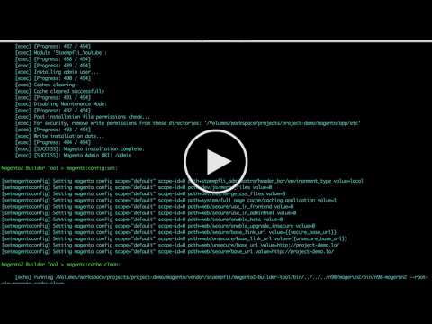

# Magento 2 Builder tool

Tool to automatically build Magento2 projects and sync data from remote servers.


## Installation

```
composer require --dev "staempfli/magento2-builder-tool":"~1.0"
```

## Demo

<a href="https://www.youtube.com/watch?v=wXt04uaZK7M&list=PLBt8dizedSZDtc1kEH2iCJGodWqQ5T6XN" target="_blank">
  
</a>

## Introduction

`magento2-builder-tool` is a tool to setup local environments for your Magento2 projects by executing one command. No Docker, no Vagrant needed but it is also compatible inside those virtualised setups. Database, Apache/Nginx configuration and everything else are created automatically for each project. You can even use `sync` mode to get server data copied locally.

This tool is also meant for `CI` environments to automate the step of creating the build. You can use it to get your project generated before executing the tests.

What this tool does for you:

```
1. Create Magento Database
2. Create Integration Test Database
3. Magento Install
4. Sync Data From Server
5. Update core_core_data for your environment
6. setup:upgrade
7. clean cache
8. Setup Apache/Nginx configuration
```

Only manual step is to edit your `/etc/hosts` 

### DnsMasq on MAC

On `OS X` you can even skip the manual step of editing the `etc/hosts` by using `dnsmasq`. You can configure it to automatically load all `*.dev` or `*.lo` urls (`*.local` does not work).

* [Never Touch Your Local /etc/hosts File in OS X Again](http://alanthing.com/blog/2012/04/24/never-touch-your-local-etchosts-file-os-x-again/)

**NOTE**: When adding a new `dnsmasq`, you need to reload the `dnsmasq daemon`:

```
sudo launchctl unload -w /Library/LaunchDaemons/homebrew.mxcl.dnsmasq.plist
sudo launchctl load -w /Library/LaunchDaemons/homebrew.mxcl.dnsmasq.plist
```

## Setup

### Config Folder

```
cp -r <vendor_path>/staempfli/magento2-builder-tool/config.sample/ config
```

* Set the project custom `core_config_data` on `config/mg2-builder/magento/config.yaml`
* Set the project servers settings on `config.sample/mg2-builder/server/config.yaml`

**NOTE:** You only need to replace parameters between `<>` with your corresponding values. All other placehoders like `${}` or `{{}}` will be automatically replaced during the tool execution

### Create logs folder

```
mkdir logs
vim logs/.gitignore
# Ignore everything in this directory
*
# Except this file
!.gitignore
```

### Custom Properties

You can customise all properties according to your needs:

* Properties added in `config/mg2-builder/project.properties` have the highest priority and will overwrite default ones
* Check all properties that can be customised here:
	* [build/config/default.properties](build/config/default.properties)

## Usage

* List available targets:

	* `bin/mg2-builder -l`

* Project install:

	* `bin/mg2-builder install`

* Sync data from server:

	* `bin/mg2-builder sync`

## TIPS

### Local settings

If you do not want to input over and over again the properties required, you can setup your default environment parameters as follows:

1. Create folder `_conf` at one level higher than your project root.

2. Add a new file `environment.properties` inside that folder.

3. Inside this file you can specify your environment properties as follows:

```
project.environment=<your_environment_type> (usually Local)
database.admin.username=<your_database_admin_user>
environment.server.type=<your_server_type> (apache, nginx or none)
environment.vhosts.dir=<your_preferred_vhost.d_path>
```

### SSH without password

To skip entering the ssh password every time, you can use `ssh-copy-id` to automatically set the public-private keys on the server.
Simply execute:

```
ssh-copy-id user@server-domain
```

## Custom scripts

If you need additional scripts to build your projects, you can add them here:

* `config/mg2-builder/xmlscripts/custom.xml`

You can also define targets that will be automatically executed during the build process.
This tool contains `customHooks` that can be listened to dispatch other targets.
You can set inside `config/mg2-builder/project.properties` the targets to be executed by these hooks:

```
vim config/mg2-builder/xmlscripts/custom.xml
before-magento-install = <your-custom-target>
after-sync = <your-custom-target>
after-tests-setup-integration = <your-custom-target>
after-util-db-clean = <your-custom-target>
```

## Disclaimer

In order to use sync functionalities, `n98-magenrun2` must be available on the remote server. The easiest way is to add it as part as your project dependencies:

```
composer require "n98/magerun2":"^1.4"
```

If you install `n98-magerun2` in your server in another way, be sure to configure the parameter `sync.bin.n98-magerun2` accordingly:

* [build/config/default.properties#L26](build/config/default.properties#L26)

## Troubleshooting

#### MySQL server has gone away

*  **Problem**: On Mac computers, `MySQL` crashes sometime when creating, importing or updating the Magento database.

* **Solution**: Kill MySQL process, start MySQL and try again: 

	1. `killall -9 mysqld`
	2. `mysql.server start` or `mysql.server restart`
	3. Try again: `mg2-builder install`

## Prerequisites

- PHP >= 7.0.*
- Mysql >= 5.7.*

## Developers

* [Juan Alonso](https://github.com/jalogut)

Licence
-------
[GNU General Public License, version 3 (GPLv3)](http://opensource.org/licenses/gpl-3.0)

Copyright
---------
(c) 2017 Staempfli AG
